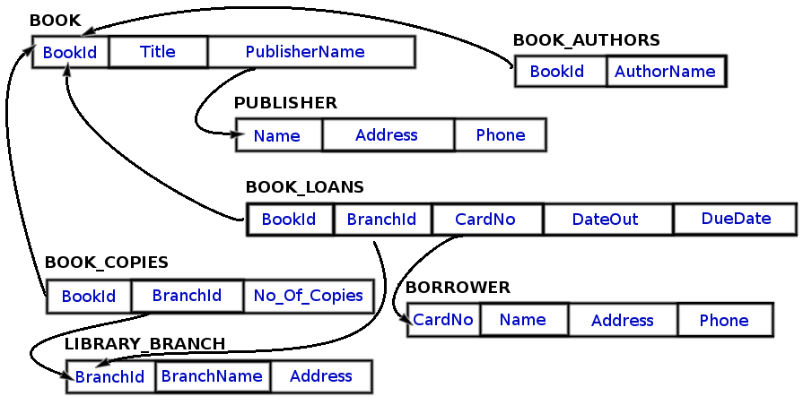

# [SQLserverDB-LibraryMGMTsystem](./Tech-Acad-Projects/tree/master/sql_srvr_db)
SQL server library database and stored procedures. Using  Created a db with multiple library branches, multiple copies of books, book publishers, borrowers.

Assignment: Using MS SQL Server 2014 Express, create a database and schema as depicted in the following diagram: 

## Tech Academy SQL server drill
Created 6/21/2017 by Laurie Roy for the database course, Tech Academy, Portland, OR

Additionally, there were certain requirements about the number of books, branches, authors, publishers and patrons. I created a mock library of 4 branches and 93 books, 30 authors, 15 publishers, and 10 patrons.  To view, restore the backup or view the files individually.

Stored procedures were created to answer the following questions: 
[1](dbo.uspBookCount.sql) How many copies of the book titled "The Lost Tribe" are owned by the library branch whose name is "Sharpstown"? 

[2] dbo.uspBookCountBranchesShort.sql) How many copies of the book titled "The Lost Tribe" are owned by each library branch?
	[returns with branch name](dbo.uspBookCountBranches.sql

[3] (dbo.uspMemberNoneCheckedout.sql) Retrieve the names of all borrowers who do not have any books checked out.

[4] (dbo.uspCheckedoutDueToday.sql) For each book that is loaned out from the "Sharpstown" branch and whose DueDate is today, retrieve the book title, the borrower's name, and the borrower's address.

[5] (/dbo.uspBranchBooksOut.sql) For each library branch, retrieve the branch name and the total number of books loaned out from that branch.

[6](dbo.uspBorrowers5books.sql) This procedure returns names, addresses, and number of books checked out for all borrowers who have more than five books checked out.

[7] (dbo.uspBranchCopiesByStephenKing.sql) For each book authored (or co-authored) by "Stephen King", retrieve the title and the number of copies owned by the library branch whose name is "Central".